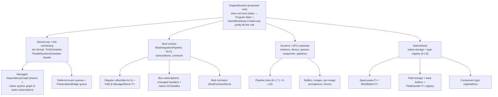

---
# Auto-generated from docs/governance/REGISTER.yaml — DO NOT EDIT MANUALLY
# Manual edits overwritten by sync_register.ps1 on next sync.
register_id: DOC-A-RESOURCE_OWNERSHIP_AND_LIFETIME
category: A
tier: 1
lifecycle: AUTHORED
owner: Crystalka
version: "0.1.1"
next_review_due: post-ratification closure
register_view_url: docs/governance/REGISTER_RENDER.md#DOC-A-RESOURCE_OWNERSHIP_AND_LIFETIME
---
# Resource Ownership and Lifetime (A2)

> **Status: authored proposal (normative target) — NOT current truth.** This document was produced by the architecture decomposition session of 2026-07-15 (report: [ARCHITECTURE_DECOMPOSITION_CONTRACTS_SESSION_20260715](../reports/ARCHITECTURE_DECOMPOSITION_CONTRACTS_SESSION_20260715.md), HEAD `6f39903`). It is the missing "A2" contract: no document in the corpus today defines an ownership tree, a dispose order, or a rule for a parent dying while a child is live — the vocabulary exists only as ~31 scattered per-domain fragments. Sections marked **(current truth)** describe verified code state; everything else is a normative target requiring ratification per [FRAMEWORK](../governance/FRAMEWORK.md) §7 (amendment milestone protocol, §7.2: deliberation milestone → amendment plan → execution → CAPA entry → audit-trail event). Ratification path: the ownership tree (§1) plus the dispose and destruction laws (§4, §6) become a new LOCKED document; the per-resource rows of §2 fold into [ECS](./ECS.md), [FIELDS](./FIELDS.md), [MOD_OS_ARCHITECTURE](./MOD_OS_ARCHITECTURE.md) and [VULKAN_SUBSTRATE](./VULKAN_SUBSTRATE.md) as amendments to those documents. Until ratified, any conflict between this text and a Tier 1 LOCKED document resolves in favor of the LOCKED document (conflicts are inventoried, not silently resolved — see §7).

Scope: every resource whose lifetime exceeds one function call — native world storage, spans and batches, fields, ALCs, subscriptions, GCHandles, GPU handles, queues. Fragments that already legislate locally, and which this contract composes rather than replaces:

- **K-L8**: «Native owns storage, managed holds opaque `IntPtr`» (`KERNEL_ARCHITECTURE.md:57`) — the single-ownership-boundary pattern this document generalizes.
- **FIELDS**: buffers «fixed at registration» (`FIELDS.md:34`); «The back buffer is allocated at field registration time, not lazily on first dispatch — there is no "field without back buffer" state» (`FIELDS.md:68`); span lifetime and mutation rejection (`FIELDS.md:144`); handle caching forbidden — fetch through `IModApi.Fields.Get` per tick, «not cache it in components» (`FIELDS.md:349`).
- **EVENT_BUS**: subscription lifecycle — «a missing `Unsubscribe` is a leak», subscribe in `OnInitialize()`, unsubscribe in `OnDispose()`, and the ALC unload chain auto-unsubscribes every recorded mod subscription (`EVENT_BUS.md:105-119`); plus the reserve-then-consume gameplay Lease model (`EVENT_BUS.md:89-101`).
- **MOD_OS**: collectible ALC per regular mod (`MOD_OS_ARCHITECTURE.md:206`), the never-unloaded shared ALC (§5.1, `:581-586`), the §9.5 nine-step unload chain with its `WeakReference` GC pump, and §9.5.1 best-effort semantics.
- **VULKAN**: `IDisposable` handle wrappers (§`DualFrontier.Runtime.Graphics`, `VULKAN_SUBSTRATE.md:484`); per-image semaphores + frame fence (§2.3.1, `:566`); «Hard sync (`waitIdle`) is available but only used for save snapshots and shutdown» (§7.3.1, `:1317`); «`Runtime.Create` disposes partially-constructed components on failure» (§1.1, `:164`).

What no document states is the unifying law. The cost is measurable at shutdown today: the production `NativeWorld` is never destroyed deterministically, the native scheduler and bus are never torn down, mods are never unloaded at exit, and native-subscription `GCHandle`s pin managed objects until process death (§4.3, gaps G1–G6). This contract supplies the law.

### Definitions

These terms are used normatively throughout:

- **Owner** — the unique holder responsible for calling a resource's release primitive. Ownership is exclusive; it can be *transferred* (documented, single handoff) but never shared.
- **Borrowed reference** — any non-owning handle. A borrower may use but never release, and must be prepared for the owner to declare the resource dead (via the idempotent dispose state, never via dangling memory).
- **Lease** — a time-bounded borrow that *pins* some capability of the parent while held (a `SpanLease<T>` pins world mutation; a `WriteBatch<T>` pins destroy-flush). Leases have a mandatory release horizon (§3.2: the phase boundary).
- **Quiesce point** — a proven global state in the shutdown sequence after which a class of activity can no longer occur (Q1: no simulation mutator runs; Q2: no native→managed callback can fire). Steps after a quiesce point may rely on it unconditionally.
- **Logically released / physically reclaimed** — the two halves of an asynchronous release (§5). Logical release cuts all ownership edges and is what commits bind to; physical reclamation returns the memory/handles and is best-effort, budgeted, observable.
- **Hard fault** — deliberate fail-fast with diagnostics (§6.2). The alternative being prevented is undefined behavior, which is never an accepted outcome of any lifetime race.
- **Idempotent dispose** — law 4 of §1: second and later Dispose calls are no-ops; use-after-dispose throws; finalizers never substitute for the deterministic path.

## §1 The ownership tree (target)

There is exactly one root. Every resource in the process is reachable from it by ownership edges; anything unreachable is by definition leaked.

Four laws define the tree:

1. **Parent owns child.** Exactly one owner per resource. The owner is whoever must call the release primitive; every other holder has a borrowed reference. This is the K-L8 pattern generalized: native owns the storage, the managed side holds a handle it did not create and must not free twice.
2. **Child never outlives parent.** A child handle surviving its parent is a *law violation*, not a tolerated state. The per-domain statements already exist: a `FieldHandle<T>` cached in a component outlives its registry on mod reload — forbidden (`FIELDS.md:349`); a bus subscription outliving its subscriber is «a leak» (`EVENT_BUS.md:105`); a span outliving its world is undefined behavior (§6).
3. **Dispose closes the tree in reverse creation order.** Children first, then the parent — within each subtree and for the session as a whole (§4). The Vulkan subtree already models this exactly: `Runtime.Dispose` walks sprite pipeline → uploader → sampler → assets → compute pipelines → allocator → command pools → framebuffers → render pass → swapchain → surface → device → validation layer → instance → window, the precise reverse of construction (`Runtime.cs:438-477`).
4. **Dispose is an idempotent state machine.** `Created → Live → Disposed`. Double-dispose is a no-op; use-after-dispose throws `ObjectDisposedException`; there is no resurrection state. Existing precedents to standardize on: `NativeWorld.Dispose` zeroes its handle and suppresses finalization (`NativeWorld.cs:486-494`); `ManagedSystemDispatcher.Release` is documented «Idempotent» (`ManagedSystemDispatcher.cs:93`); `LauncherRenderer` gates entry points with `ObjectDisposedException.ThrowIf` (`LauncherRenderer.cs:74`).

### §1.1 Where the tree lives today (current truth)

**EngineSession does not exist.** The composition root is split between `Program.Main` (`src/DualFrontier.Launcher/Program.cs:28-98`) and `GameBootstrap.CreateLoop` (`src/DualFrontier.Application/Loop/GameBootstrap.cs:70-220`):

- `Program.Main` owns the GPU subtree correctly (`using var runtime`, `Program.cs:43`; `using var renderer`, `:61`) — construction and disposal are paired.
- `CreateLoop` *builds* the remaining three subtrees but *carries* only two of them out: it constructs the `NativeWorld` as a local (`GameBootstrap.cs:76` — `Bootstrap.Run(useRegistry: true)`, `Bootstrap.cs:61`), wires systems, graph, native scheduler registration (`:160-181`), mod pipeline (`:203-206`) and bus bridge (`:212`), then returns `new GameContext(loop, controller)` (`:219`).
- `GameContext` is `internal sealed record GameContext(GameLoop Loop, ModMenuController Controller)` (`GameContext.cs:19`) — the world, the bus bridge, the pipeline reference and the native singleton registrations fall out of the ownership graph the moment `CreateLoop` returns. They remain *alive* (rooted through scheduler → loop) but *unowned*: no one can dispose what no one holds.

The proposal is a real `EngineSession : IDisposable` owning the four subtrees, constructed by the Launcher, disposed exactly once, in §4 order.

## §2 Per-resource lifetime table

Columns: what the resource is, who creates it, who owns it (today → target), what bounds its lifetime, how it is disposed today, how it must be disposed under this contract, and the verified gap.

| # | Resource | Created by | Owner (today → target) | Lifetime bound | Disposal path (today) | Disposal path (target) | Today's gap |
|---|---|---|---|---|---|---|---|
| R1 | `NativeWorld` | `Bootstrap.Run` (`Bootstrap.cs:61`) at `GameBootstrap.cs:76` | none — local var → **EngineSession** | session | GC finalizer → `df_world_destroy` (`NativeWorld.cs:496-503`); never deterministic | `Dispose()` at step S7, after leases drained (§6) | Leaks to finalization; finalizer races the sim thread after `Join(2000)` timeout (§4.3 G1) |
| R2 | `SpanLease<T>` / `WriteBatch<T>` | `NativeWorld.AcquireSpan` / `BeginBatch` (`ECS.md:67`) | acquiring system (`using` scope) | phase — released before phase end (§3) | `using`-Dispose → `df_world_release_span` (`SpanLease.cs:117-122`); batch auto-flushes on Dispose (`WriteBatch.cs:36-37`) | same + DEBUG leak registry (§3.4) | No finalizer, no tracking: a leaked lease pins world mutation forever, silently |
| R3 | `FieldHandle<T>` + field storage + back buffer | field registration via `IModApi.Fields`; buffers «fixed at registration» (`FIELDS.md:34`, `:68`) | registering mod / per-world `FieldRegistry` (`FIELDS.md:258`) → world subtree | mod lifetime, else world | `FieldRegistry.Unregister` (`FIELDS.md:292`); buffers die with world; back buffer never persisted (`FIELDS.md:300`) | fold into world-subtree dispose; handles re-fetched per tick (`FIELDS.md:349`) | World never disposed → field buffers reclaimed only by process exit |
| R4 | Component type registrations | `VanillaComponentRegistration.RegisterAll` (`GameBootstrap.cs:77`) + auto-register on first use (`NativeWorld.cs:519-526`) | `ComponentTypeRegistry` bound to its world | world | die with the world handle | same, deterministically at S7 | Legacy static `NativeComponentTypeRegistry` fallback is process-global (`NativeWorld.cs:527-529`) |
| R5 | Native system graph + wake subscriptions | registration loop `GameBootstrap.cs:160-181` (`RegisterSystem` + `SubscribeTimer`) | none — process-global native singletons → **LOOP subtree** | session | `SystemGraphInterop.Clear()` / `WakeRegistryInterop.Clear()` run only at the *start of the next bootstrap* (`GameBootstrap.cs:160-161`) | explicit Clear at step S5 | No teardown ever runs at exit (§4.3 G2) |
| R6 | Managed `DependencyGraph` / `ParallelSystemScheduler` | `GameBootstrap.cs:145-148`, `:192-199` | `GameLoop` (ctor injection) | session | GC | disposed with the loop; systems receive `OnDispose` | Core systems' `OnDispose` never invoked at exit; `SchedulerAdapter.ClearCallback` (`SchedulerAdapter.cs:59`) is test-only |
| R7 | Domain-bus subscriptions — managed handlers + native `GCHandle`s | `OnInitialize` (`EVENT_BUS.md:105-119`); bootstrap bridge lambdas (`GameBootstrap.cs:82-93`); `ManagedBusBridge.Subscribe*` allocates tracked `GCHandle`s (`ManagedBusBridge.cs:80-92`) | subscriber; bridge tracks native handles → **MODS/LOOP subtrees** | subscriber lifetime | mods: unload-chain steps 1 + 3.5 (§9.5); core systems + bootstrap lambdas: never; `GCHandle`s freed only in `Unsubscribe` (`ManagedBusBridge.cs:94-100`) or `ClearForTesting` (`:129-137`) | unsubscribe in reverse at S5; free every tracked handle | «Missing `Unsubscribe` is a leak» (`EVENT_BUS.md:105`) — yet the core-side leak is today's normal; production never frees native `GCHandle`s (§4.3 G3) |
| R8 | Deferred event queues | per-bus unbounded `ConcurrentQueue` (`DomainEventBus.cs:28`) | each `DomainEventBus` | tick phase | `FlushDeferred` after every phase barrier (`ParallelSystemScheduler.cs:167`; `EVENT_BUS.md:47`) | flush-or-drop decided at quiesce point Q1 (§4.1 S3) | Events queued at `Stop()` are dropped implicitly, uncounted |
| R9 | `PresentationBridge` queue | `Program.cs:54`; `ConcurrentQueue<IRenderCommand>` (`PresentationBridge.cs:21`) | bridge; renderer drains per frame | frame | drained by `RenderFrame`; leftovers die with the process | drop after S2, documented as derived state | The drop is implicit and unstated today |
| R10 | Vulkan instance / device / swapchain / pipelines / buffers / fences | `Runtime.Create`; renderer sync objects in `LauncherRenderer` | `Runtime` / `LauncherRenderer` | process | model citizen: `renderer.Shutdown()` = WaitIdle → per-image semaphores → frame fence → command buffer (`LauncherRenderer.cs:199-222`); `using` runtime → reverse-order dispose (`Runtime.cs:438-477`) | unchanged — steps S6/S8 | Order relative to world/mods/native singletons is nowhere stated (§4.3 G6) |
| R11 | Pipeline slots | native `pipeline_slot` state machine (K-L7.1 / K-L16) | native scheduler / GPU subtree | session | quiescence checked only for mod unload (K-L18; `MOD_OS_ARCHITECTURE.md` §9.7); nothing at exit | drain to `Empty`/`ReadableAsTail` before S6 device teardown | `waitIdle` covers GPU work but the slot state machine is never quiesced at exit; save-side serialization is stub (`PipelineSlotInterop.cs:201-204`) |
| R12 | ALC — regular (collectible) / shared (non-collectible) | `ModLoader` (`MOD_OS_ARCHITECTURE.md:206`, `:581-586`) | `ModIntegrationPipeline` | mod enable→disable / process | §9.5 nine-step chain; bulk `UnloadAll` (`ModIntegrationPipeline.cs:780`) — **zero callers**; shared ALC never unloads by design (`ModIntegrationPipeline.cs:768-769`) | `UnloadAll` at step S4 | The entire unload chain is unreachable at exit (§4.3 G4) |
| R13 | Path β `ManagedStore<T>` | mod registration (K-L3.1; `ECS.md:42`, `:129-132`) | mod ALC | mod lifetime; runtime-only, never persisted (`ECS.md:50`) | dies with ALC unload | same | Inherits R12's gap: never released at exit |
| R14 | Mod contracts (`RevokeAll`) | pipeline `Apply` | `ModContractStore` | mod lifetime | `RevokeAll(modId)` at unload step 2 (`ModIntegrationPipeline.cs:639`) and `Apply` rollback (`:420`, `:464`) | same, reached via S4 | Unreached at shutdown — no `UnloadAll` call |

### §2.1 Row notes (current truth)

- **R2 identity caveat.** `SpanLease<T>.Pairs` synthesizes `EntityId` with `Version = 1` because the span ABI returns no version array (`SpanLease.cs:76-84`, `:112`); several systems synthesize version 0 from `Indices` (e.g. `GameBootstrap.cs:241`). Identity is the A5 contract's problem, but it intersects lifetime here: version-collapsed ids weaken the generation check that is supposed to detect use-after-destroy of *entities* — the entity-level analog of this document's world-level rule.
- **R7 dispatch asymmetry.** Sync delivery wraps each handler in try/catch (`DomainEventBus.cs:158-165`); deferred delivery propagates handler exceptions — its try/finally only pops the execution context (`DomainEventBus.cs:168-186`). Fault containment at the flush boundary is therefore weaker than at publish, which matters once S3 decides to *flush* rather than drop.
- **R7 dispatcher handle.** `ManagedSystemDispatcher` allocates a strong `GCHandle` to itself at construction (`ManagedSystemDispatcher.cs:55`) for the batched-callback ABI. Production never registers it today (the dispatch adapter is unwired — session finding C1), so the missing `Release`/`ClearCallback` on shutdown is a latent gap that becomes live at the К10.2 cutover.
- **R8 drop primitive exists.** `DomainEventBus.Clear()` drops all handlers and pending deferred events and is documented «Used by tests and scene reloads» (`DomainEventBus.cs:141-145`) — S3 needs a counted variant of exactly this, not new machinery.
- **R10 construction-failure precedent.** `Runtime.Create` disposes the partially-constructed runtime on any failure (`Runtime.cs:183`; `VULKAN_SUBSTRATE.md:164`). This is the constructor-side half of law 3 and should be cited as the pattern for `EngineSession` construction.
- **R4/R5 scope mismatch.** The world and its type registry are *instance*-scoped (`Bootstrap.Run` returns a handle), but the native scheduler graph, wake registry, bus tiers and the legacy `NativeComponentTypeRegistry` are *process-global* singletons. Two lifetime classes cross: a second `CreateLoop` in one process inherits the first call's native scheduler/bus state — which is exactly why the registration loop must defensively `Clear()` at start (`GameBootstrap.cs:160-161`). The target tree resolves the mismatch by making `EngineSession` the singletons' logical owner: acquire at construction, clear at S5, assert-clean at next construction.
- **R12 reclamation fragility.** Physical ALC reclamation is fragile enough to depend on stack-frame hygiene: `UnloadAll` snapshots mod ids in a `[MethodImpl(NoInlining)]` helper because in DEBUG «the JIT retains the last iterated value through the remainder of the method's lexical scope … the second per-mod step 7 spin always times out because `UnloadAll`'s foreach var is still rooting the last `LoadedMod`'s `ModLoadContext`» (`ModIntegrationPipeline.cs:788-796`, `:836-843`). Evidence for §5's stance: physical reclamation can never be a commit precondition, because even a compiler mode can defer it.

## §3 Lease and pinning law

### §3.1 Spans pin storage (current truth)

Acquiring a span increments an atomic counter; while `active_spans_ > 0`, every structural mutation (`Add`/`Remove`/`Destroy`/`Flush`) is «silently rejected by the native side — the throw is caught at the C ABI boundary» (`SpanLease.cs:16-19`; rejection sites `world.cpp:85-180`; counter `world.h:167`; acquire/release `world.cpp:231-260`). Fields replicate the pattern exactly: `write_cell`, `set_conductivity`, `set_storage_flag` and `swap_buffers` all reject while a field span is out (`FIELDS.md:144`; `tile_field.h:25`, `:80`; `tile_field.cpp:23`). Compute dispatches are deliberately *not* gated by the counter — they carry their own fence-based buffer ownership (`FIELDS.md:146`).

### §3.2 Leases release before phase end

«Caller MUST Dispose the lease before issuing mutations» (`SpanLease.cs:20`). `WriteBatch` requires all batches disposed before destroy-flush operations resume (`WriteBatch.cs:44-46`), and the scheduler flushes staged writes at the phase boundary so parallel readers observe a consistent snapshot (`ECS.md:90`). The phase boundary is therefore the lease horizon this law fixes: **a lease that crosses a phase boundary is a defect**, because it holds the entire world's write path hostage into a phase that expects to mutate.

### §3.3 Enforcement — and what a leak does today

The *pin* is enforced mechanically and well (native atomic + rejection). The *release* is enforced by nobody: it rests on the C# `using` idiom and review. `SpanLease<T>` is a sealed class with **no finalizer** (`SpanLease.cs:23-123`) — deliberately, since a GC-timed release would unpin storage at a nondeterministic moment — so a leaked lease never decrements the counter.

Consequences of a single leaked lease, today:

- the counter stays positive forever; every subsequent mutation fails *silently* (0 return code, swallowed at the ABI); the game degrades into a read-only museum with no diagnostic naming the culprit;
- the managed side cannot even observe the pin: `World::active_spans_count()` exists (`world.h:76-78`) but no `df_world_*` export surfaces it (zero hits in `df_capi.h`);
- the release path self-heals underflow by clamping to zero (`world.cpp:254-260`) — double-release cannot corrupt state, but pairing bugs are masked rather than reported.

### §3.4 Proposed enforcement (target)

1. Export the counter (`df_world_active_span_count`) and, in DEBUG, assert it is zero at every phase boundary — the scheduler already owns that boundary (`ParallelSystemScheduler.cs:167` is the flush hook).
2. DEBUG lease registry: acquisition stack, owning system, tick number; dumped by the phase-boundary assert and by the world-dispose timeout (§6).
3. Count rejected mutations per world and surface the counter through diagnostics, so silent rejection is at least visible in RELEASE (the native bus already sets the observability precedent).
4. Replace the silent underflow clamp with a DEBUG assert on release-without-acquire.

*Vocabulary note:* the EVENT_BUS «Lease model» (`EVENT_BUS.md:89-101`) is a *gameplay* protocol — mana reserve-then-consume, Open/Active/Closed, refusal reasons. Same lifecycle shape, different layer. This section governs storage leases only; [RESOURCE_MODELS](../mechanics/RESOURCE_MODELS.md) owns the gameplay selection rules.

## §4 Shutdown law (target)

Shutdown is the ownership tree closing in reverse, with two explicit quiesce points. K-L18 already defines quiescence for mod operations — sim paused + pipeline slots quiescent (`MOD_OS_ARCHITECTURE.md` §9.7); this law generalizes the same idea to process exit.

### §4.1 The eight steps

1. **S1 — Stop intake.** No new work enters the tree: stop forwarding input to the sim (vacuously satisfied today — input is drained and discarded, `Program.cs:81-84`), and gate mod operations (the pipeline already throws while the scheduler runs, `ModIntegrationPipeline.cs:782-784`).
2. **S2 — Finish the current tick: bounded, never abandoned.** Cancel, then join the sim thread with a deadline derived from the tick budget. On deadline miss: **hard fault** — fail fast with a thread dump; never proceed to teardown with a live mutator. Today `Stop()` does `_cts.Cancel(); _thread?.Join(2000)` and returns regardless of the outcome (`GameLoop.cs:73-77`); the `IsBackground = true` thread (`GameLoop.cs:67`) may still be inside `ExecuteTick` (`GameLoop.cs:115`) — touching the world and the native bus — while everything below it is being destroyed. → **Quiesce point Q1: the simulation is provably stopped.**
3. **S3 — Flush or drop deferred queues, stated per queue.** Deferred domain events: **drop with a count** — handlers must not run after Q1, and the queues are unbounded `ConcurrentQueue`s (`DomainEventBus.cs:28`); the drop primitive already exists as `Clear()` (`DomainEventBus.cs:141-145`) and needs only a count. Native Background tier: **drop**, recording the pending count — draining would invoke managed callbacks post-quiesce. `PresentationBridge`: **drop** (`PresentationBridge.cs:21`) — render commands are derived state. A future save-on-exit flow may force a flush *before* Q1 instead; open question, §7.2.
4. **S4 — Unload mods.** `ModIntegrationPipeline.UnloadAll()` (`ModIntegrationPipeline.cs:780`) runs the §9.5 chain per mod: `UnsubscribeAll` → `RevokeAll` → `RemoveSystems` → native mod state (step 3.5) → Vulkan mod-resource placeholder (step 3.6) → graph rebuild → scheduler swap → `ALC.Unload()` → bounded reclamation pump. **Today this method has zero callers** (verified corpus-wide). Reclamation beyond the pump budget is deferred, not awaited — §5.
5. **S5 — Tear down native scheduler and bus; free every `GCHandle`.** `SystemGraphInterop.Clear()` + `WakeRegistryInterop.Clear()` (today executed only at next-bootstrap start, `GameBootstrap.cs:160-161`); `SchedulerAdapter.ClearCallback()` (`SchedulerAdapter.cs:59` → `df_scheduler_clear_managed_callback`, `capi.cpp:1338`); `df_bus_clear` in its fixed fast→normal→background lock order (`bus_common.cpp:68-80`; `EVENT_BUS.md:64`) plus freeing every tracked subscription `GCHandle` — logic that exists verbatim in `ManagedBusBridge.ClearForTesting` (`ManagedBusBridge.cs:129-137`) and must be promoted to a production shutdown surface. → **Quiesce point Q2: no native path can call back into managed code.**
6. **S6 — GPU waitIdle, then dispose the Vulkan tree.** `renderer.Shutdown()` — WaitIdle → per-image semaphores → frame fence → command buffer (`LauncherRenderer.cs:199-222`) — then `Runtime`'s reverse-order dispose (`Runtime.cs:438-477`). These are today's model citizens and are kept as-is; pipeline slots must be drained to `Empty`/`ReadableAsTail` first (R11).
7. **S7 — Dispose `NativeWorld` deterministically.** Exactly one `df_world_destroy`, issued after `active_spans_ == 0` per §6. The finalizer (`NativeWorld.cs:496-503`) ceases to be a teardown path and becomes a DEBUG leak reporter.
8. **S8 — Window, then process.** Window disposal already sits last inside `Runtime.Dispose` (`Runtime.cs:477`). Process exit reclaims whatever §5 left pending, and the exit log records it.

### §4.2 Today's order (current truth)

`Program.cs:94-97` plus the `using` unwind at `:43`/`:52`/`:61`:

1. `gameContext.Loop.Stop()` — cancel + `Join(2000)`, result ignored;
2. `renderer.Shutdown()` — WaitIdle + semaphores/fences/command buffer;
3. scope exit — `renderer` (idempotent re-Shutdown), `atlasTexture`, then `runtime` (WaitIdle + full Vulkan teardown + window) via `using`-dispose.

Three steps of the needed eight. No world, no mods, no native singletons, no GCHandles anywhere in the sequence.

### §4.3 The six gaps (evidence)

- **G1 — the world is never destroyed.** `NativeWorld` is a local in `CreateLoop` (`GameBootstrap.cs:76`) and is not carried by `GameContext` (`GameContext.cs:19` holds only `Loop` + `Controller`); no `df_world_destroy` call exists anywhere in Application or Launcher. The world leaks to GC finalization (`NativeWorld.cs:496-503`) — and the finalizer races the possibly-still-running sim thread after the `Join(2000)` timeout (`GameLoop.cs:76`).
- **G2 — no native scheduler teardown.** `SystemGraphInterop.Clear()` runs only at bootstrap *start* (`GameBootstrap.cs:160`); `SchedulerAdapter.ClearCallback` is invoked exclusively by tests (`tests/DualFrontier.Core.Tests/Scheduler/BatchedCallbackTests.cs:35`, `:72`). Latent rather than crashing only because production never registers the managed callback today (adapter unwired); it goes live at the К10.2 dispatch cutover.
- **G3 — no native bus teardown.** `df_bus_clear` is reachable solely through `ManagedBusBridge.ClearForTesting` (`ManagedBusBridge.cs:131`) and is declared «test-only» at the ABI itself (`bus_native.h:155`); subscription `GCHandle`s are never freed on any production path.
- **G4 — mods are never unloaded.** `ModIntegrationPipeline.UnloadAll` (`ModIntegrationPipeline.cs:780`) has zero callers; `RevokeAll`, `UnsubscribeAll`, and native mod-state teardown are unreachable at exit.
- **G5 — `gameContext` is never disposed.** `Program.cs:55` holds it as a plain local; the record is not `IDisposable`; `GameLoop.Dispose` (`GameLoop.cs:141`) and its `CancellationTokenSource` (`GameLoop.cs:42`) are never disposed.
- **G6 — no stated order.** Nothing prescribes where the world, the mods, or the native singletons belong relative to `Loop.Stop` / `renderer.Shutdown` / `runtime` disposal. The Vulkan subtree's internal order is exemplary precisely because it is the only subtree that has a written law.

### §4.4 Adoption sketch (informative)

The minimal-diff path from §4.2 to §4.1, in implementation order — each step is independently landable and testable:

1. Introduce `EngineSession : IDisposable` in Application; `GameBootstrap.CreateLoop` returns it, carrying today's `GameContext` members **plus** the `NativeWorld`, the `ManagedBusBridge`, and the `ModIntegrationPipeline` (closes the R1/R7/R12 ownership holes without changing behavior).
2. Give `EngineSession.Dispose` the S2→S7 body: bounded join with fault-on-timeout; counted queue drops (reuse `DomainEventBus.Clear`, `DomainEventBus.cs:141-145`); `UnloadAll()` — its first caller; a production `ManagedBusBridge.Shutdown()` promoted from `ClearForTesting` (`ManagedBusBridge.cs:129-137`) plus `SystemGraphInterop.Clear` / `WakeRegistryInterop.Clear` / `SchedulerAdapter.ClearCallback`; then `world.Dispose()`.
3. In the Launcher, replace the bare locals with `using var session = GameBootstrap.CreateSession(bridge)` and delete the ad-hoc `Loop.Stop()` call — `Program.cs:94-97` becomes `renderer.Shutdown()` sandwiched by the two `using` unwinds, which realizes the S-order for free (S6 runs inside the existing `using var renderer/runtime`, S7–S8 inside the session/runtime unwind).
4. Add the §3.4/§6.2 native surface (`df_world_active_span_count`, checked destroy) last — everything above it is pure managed re-plumbing.

Verification hooks: the existing `WeakReference`-based unload tests (§9.5, «mandatory for every regular mod», `MOD_OS_ARCHITECTURE.md` §10.4) extend naturally to an `EngineSession` leak test — construct, run N ticks, dispose, assert world handle zeroed, native subscriber counts zero (`ManagedBusBridge.SubscriberCount`, `ManagedBusBridge.cs:120-126`), span count zero.

## §5 Deferred reclamation

Some releases cannot complete synchronously. The law separates two states: a resource is **logically released** when its owner has cut every edge to it (removed from registries, unsubscribed, unload initiated), and **physically reclaimed** when the memory and handles actually return. Commit decisions bind to the first state only; the second is best-effort, budgeted, and observable.

| Resource | Logically released when | Physically reclaimed when | Surfaced how (target) |
|---|---|---|---|
| Regular-mod ALC | §9.5 steps 1–6 done; mod removed from active set «regardless of whether the assembly actually unloaded» (§9.5.1) | `WeakReference` dies under the GC pump — double-collect bracket, 100 × 100 ms = 10 s (§9.5 step 7) | per-mod state record: released-at, reclaimed-at or age-of-pending, pump iterations; today only a `ModUnloadTimeout` warning + «the user is advised to restart» (§9.5 step 7) |
| Native mod state | `df_scheduler_unload_mod_native_state` accepted (T0–T7 single critical section, §9.5 step 3.5) | same call — synchronous — but it may *reject* on К-L18 non-quiescence, leaving native residue behind a logically-released mod | the returned per-tier `ModUnloadResult` metrics, persisted into the same record |
| GPU mod resources | §9.5 step 3.6 — `df_vulkan_unload_mod_resources` placeholder returns «vacuous success when no pipeline-managed mod resources are registered» | once real: after fence completion drains the deferred-destroy queue (`VULKAN_SUBSTRATE.md` §3.4) | fence-generation stamp per pending destroy batch |

Three rules:

1. **Never block a commit on physical reclamation.** Commit = registry + graph + scheduler swap; the pump runs after, inside its budget. The §9.5 chain already obeys this; S4 inherits it.
2. **Surface both states.** Diagnostics expose the table above per mod. The step-7 timeout stops being a log line and becomes a queryable state — MOD_OS already lives the logical/physical split without naming it (§9.5.1: the mod leaves the active set no matter what); this section names it.
3. **Deferred never means forgotten.** Every pending reclamation keeps an owner record until confirmed; at S8 the pending set is written to the exit log, so the restart-advice path stays honest because the evidence survives the session.

## §6 Destruction during active leases

### §6.1 Today: undefined (current truth)

- `df_world_destroy` is an unconditional `delete as_world(world)` (`capi.cpp:60-62`) — no `active_spans_` check, no liveness check, no thread check. `NativeWorld.Dispose` checks only its own handle (`NativeWorld.cs:486-494`).
- A `ReadOnlySpan<T>` produced by a live `SpanLease<T>` points directly into the freed dense storage — use-after-free, undefined behavior. The finalizer path (§4.3 G1) makes this race real rather than theoretical: after a `Join(2000)` timeout, the abandoned sim thread can be mid-span-walk inside `ExecuteTick` while GC finalizes the world at process exit.
- `WriteBatch` deepens it: its Dispose *auto-flushes* pending commands into the world (`WriteBatch.cs:36-37`), so batch cleanup ordered after world destruction mutates freed memory rather than merely reading it.

### §6.2 Target rule: wait for zero → hard fault on timeout → never UB

1. World dispose first verifies quiesce point Q1 (sim thread joined). Disposing a world that a scheduler still references is a law violation, caught by a DEBUG assert.
2. Dispose then waits for `active_spans_ == 0` — the component-store counter *and* every per-field counter (`tile_field.h:80`) — and for zero outstanding `WriteBatch` handles, with a bounded timeout on the order of one tick budget.
3. On timeout: **hard fault.** Fail fast with the §3.4 lease-registry dump (owning system, acquisition stack, tick). A crash with a name beats silent memory corruption. This deliberately mirrors the fail-fast posture of K-L19's capability check rather than MOD_OS §9.5.1's best-effort posture: losing one mod is survivable, a dangling world is not.
4. The same rule binds field teardown: `FieldRegistry.Unregister` while a field span is out waits-then-faults identically. `FIELDS.md:144` already rejects *mutation* during a span; unregistration must not be the loophole.
5. The finalizer is never a legitimate teardown path. In DEBUG it reports «world leaked to finalization» with the creation stack; the nominal path is deterministic Dispose at S7, exactly once, idempotent thereafter.

This requires one small ABI addition — a status-returning destroy (`df_world_destroy_checked`) or at minimum the exported span counter of §3.4, since today neither exists — which touches the KERNEL Part 7 status-code convention; recorded as conflict §7.1-4.

## §7 Open questions and conflicts with LOCKED texts

### §7.1 Conflicts (LOCKED prevails until ratified)

1. **MOD_OS §9.1 vs §9.5.1.** §9.1: «Transitions between states are atomic; failure mid-transition rolls back» — §9.5.1: «There is no atomic-unload guarantee … conceptually irreversible». This document sides with §9.5.1 by construction (§5's logical/physical split). Folding §5 into MOD_OS requires resolving that internal contradiction first (session finding C7).
2. **K-L18 scope.** K-L18 defines quiescence for *mod lifecycle* operations only. §4 generalizes quiesce points to process shutdown — that needs a K-L18 amendment or a new К-L invariant; until then §4 is proposal-only.
3. **`df_bus_clear` is test-only by contract** (`bus_native.h:155`; `ManagedBusBridge.cs:128` — «Test-only: clears all native bus state»). Promoting it to production step S5 amends the EVENT_BUS / K-L15 surface — including deciding whether teardown-time Fast-tier callbacks may still fire on the clearing thread (Fast tier runs callbacks on the publisher's thread, `EVENT_BUS.md:55`).
4. **KERNEL Part 7 error convention.** §6.2's wait-then-fault destroy needs a status-returning ABI entry; `df_world_destroy` currently returns `void`. The interop contract surface (the thin A6 area) must also gain thread-affinity and pointer-validity-window statements for the new entry point.
5. **ECS/FIELDS silence on destruction-during-lease.** Neither LOCKED text states what §6 states. On ratification, §6's rule lands as amendments there — not as a competing text here.

### §7.2 Open questions

- **Who owns `EngineSession`?** The Launcher composes today (`Program.cs`), but Application owns the types, and the `InternalsVisibleTo` edges run Application → Launcher (session finding N27) — either placement is expressible; deliberation picks one.
- **Does `GameContext` grow into `EngineSession`, or die?** It is an `internal sealed record` (`GameContext.cs:19`); records make poor dispose-state machines. Likely replaced, with `Loop`/`Controller` re-exposed as borrowed views.
- **Who owns `ManagedBusBridge`?** Constructed in `CreateLoop` (`GameBootstrap.cs:212`), held by `GameLoop` for the Background drain (`GameLoop.cs:127`) — but S5 needs it *after* the loop is quiesced. Under the tree it belongs to `EngineSession`, borrowed by the loop.
- **S2 deadline value.** Today's magic 2 s vs. a multiple of the tick budget vs. К-L16 pipeline-depth-aware; and whether an in-flight save (`waitIdle` path, `VULKAN_SUBSTRATE.md:1317`) extends it.
- **S3 flush-vs-drop once save-on-exit exists.** Persistence is deferred (A7 area; SaveSystem is stub, `PipelineSlotInterop.cs:201-204`). When it lands: does exit-save force a deferred-queue flush *before* Q1, or is saving always a paused-menu operation per the MOD_OS §9.2 pattern?
- **Cross-subtree GPU ownership.** Compute pipelines registered *on the world* (`NativeWorld.cs:437`, `df_world_register_compute_pipeline`) are world-owned but device-dependent. S6 (device) precedes S7 (world) — safe while the world's GPU surface is CPU-stubbed, wrong the day V1 field-compute lands. Either world GPU resources unbind in an S5.5 step, or the world subtree cedes its GPU children to the Runtime subtree.
- **Abnormal exit.** This law covers orderly shutdown only. Crash-path policy — skip S3–S5 and still attempt the S6 waitIdle, or rely entirely on OS/driver cleanup — is written nowhere; one authoritative paragraph is owed somewhere.
- **Bootstrap bridge lambdas.** `GameBootstrap.cs:82-93` subscribes five handlers that nothing ever unsubscribes. Under the target law they belong to `EngineSession` and unsubscribe at S5 — or they are declared session-lifetime and exempted *explicitly*. Silence is the only wrong option.

### §7.3 Relationship to the sibling contracts

Drafted in the same session; boundaries as follows.

- **A1 — [Concurrency and Memory Model](./CONCURRENCY_AND_MEMORY_MODEL.md).** Owns threads and happens-before. A2's quiesce points Q1/Q2 are lifetime *states*; A1 owns the memory-ordering proof that they are actually reached (e.g. what `Join` publishes). The S2 abandoned-thread gap appears in both by design — thread lifetime is the one resource jointly owned.
- **A0 — [Execution Authority Matrix](./EXECUTION_AUTHORITY_MATRIX.md).** Owns *who decides*; A2 owns *who frees*. The R5/R6 dual-scheduler rows stay lifetime-only here; cutover and deletion triggers are A0's.
- **A3 — transactions.** `Apply`'s prepare/commit/rollback and §5's commit-never-waits rule share a boundary: A3 defines commit, A2 defines what may still be pending at commit.
- **A4 — [Time and Consistency Model](./TIME_AND_CONSISTENCY_MODEL.md).** Owns when effects become *visible*; A2 owns when their storage becomes *invalid*. The phase boundary is the shared anchor (§3.2).
- **A5/A6 — identity and ABI.** The version-0/version-1 `EntityId` idioms (§2.1 R2 note) and the §6.2 checked-destroy ABI addition land there.
- **A7 — [Persistence Snapshot Contract](./PERSISTENCE_SNAPSHOT_CONTRACT.md).** Owns the S3 flush-vs-drop decision once save-on-exit exists (§7.2), and inherits §5's rule that a snapshot must never wait on physical reclamation.

---

*Drafted 2026-07-15 against HEAD `6f39903`. Companion drafts from the same session cover the remaining decomposition contracts (A0–A8); see the session report for the full matrix.*
