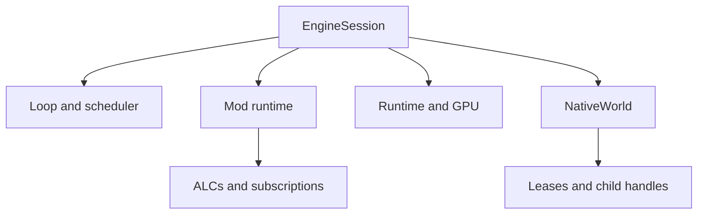
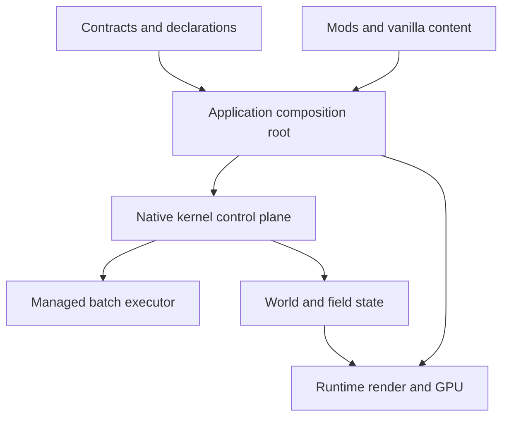

# Dual Frontier — анализ архитектурной декомпозиции по Tier 1–2

**Дата:** 2026-07-15  
**Репозиторий:** `Crystalka228/Dual-Frontier`  
**Проверенный commit:** `6f399034aba07c075d622d1594b6d1a556f96f46` (`main`)  
**Область:** актуальные архитектурные документы Category A, Tier 1–2; сопоставление их authority, ownership, dependency, lifecycle, concurrency и consistency-контрактов.  
**Не выполнялось:** повторное сканирование реализации или повторный code review.

## 1. Короткий ответ: чего не хватает до более высокой оценки

Тебе не не хватает ещё одного обычного слоя или большего числа проектов. Макроуровень уже декомпозирован хорошо: native kernel, interop, domain, application, runtime/presentation, contracts и mod OS отделены понятнее, чем в большинстве игровых движков на сопоставимой стадии.

До оценки выше **7.5/10** не хватает пяти cross-cutting декомпозиций:

1. **Единственного владельца каждого runtime-решения.** Сейчас managed и native контуры одновременно претендуют на authority над scheduling и event routing.
2. **Модели владения и времени жизни.** Документы называют владельцев больших подсистем, но не задают единую lifetime-цепочку для world, handles, spans, batches, fields, Vulkan resources, ALC и subscriptions.
3. **Формальной concurrency/memory model.** `THREADING.md` объясняет, какие workers существуют, но не задаёт полный happens-before, owner-thread, lock-order, mutation и shutdown contract.
4. **Общей модели времени и видимости состояния.** Tick, phase, deferred event, previous-tick snapshot, GPU pipeline depth, pause, save и render tail описаны в разных документах и иногда имеют разные semantics.
5. **Транзакционных границ и failure ownership.** Rebuild, mod Apply/Unload, swapchain recreation, world shutdown и C ABI failures не сведены в общую модель prepare/commit/rollback/irreversible cleanup.

Именно эти пробелы объясняют почти все самые серьёзные находки предыдущего code review: модули сами по себе выглядят чисто, но переходы между ними не имеют одного владельца и одного атомарного контракта.

## 2. Что было прочитано

В `REGISTER_RENDER` на проверенном commit находятся **34 Category A документа Tier 1–2**:

- 30 Tier 1;
- 4 Tier 2;
- 2 из них — исторические `SUPERSEDED` (`GODOT_INTEGRATION`, `VISUAL_ENGINE`);
- 32 активных документа были включены в анализ;
- общий прочитанный объём активной выборки — около **1.49 млн знаков**.

Ключевая authority surface:

- [`ARCHITECTURE.md`](https://github.com/Crystalka228/Dual-Frontier/blob/6f399034aba07c075d622d1594b6d1a556f96f46/docs/architecture/ARCHITECTURE.md)
- [`KERNEL_ARCHITECTURE.md`](https://github.com/Crystalka228/Dual-Frontier/blob/6f399034aba07c075d622d1594b6d1a556f96f46/docs/architecture/KERNEL_ARCHITECTURE.md)
- [`KERNEL_FULL_NATIVE_SCHEDULER.md`](https://github.com/Crystalka228/Dual-Frontier/blob/6f399034aba07c075d622d1594b6d1a556f96f46/docs/architecture/KERNEL_FULL_NATIVE_SCHEDULER.md)
- [`THREADING.md`](https://github.com/Crystalka228/Dual-Frontier/blob/6f399034aba07c075d622d1594b6d1a556f96f46/docs/architecture/THREADING.md)
- [`ECS.md`](https://github.com/Crystalka228/Dual-Frontier/blob/6f399034aba07c075d622d1594b6d1a556f96f46/docs/architecture/ECS.md)
- [`FIELDS.md`](https://github.com/Crystalka228/Dual-Frontier/blob/6f399034aba07c075d622d1594b6d1a556f96f46/docs/architecture/FIELDS.md)
- [`EVENT_BUS.md`](https://github.com/Crystalka228/Dual-Frontier/blob/6f399034aba07c075d622d1594b6d1a556f96f46/docs/architecture/EVENT_BUS.md)
- [`CONTRACTS.md`](https://github.com/Crystalka228/Dual-Frontier/blob/6f399034aba07c075d622d1594b6d1a556f96f46/docs/architecture/CONTRACTS.md)
- [`ISOLATION.md`](https://github.com/Crystalka228/Dual-Frontier/blob/6f399034aba07c075d622d1594b6d1a556f96f46/docs/architecture/ISOLATION.md)
- [`MOD_OS_ARCHITECTURE.md`](https://github.com/Crystalka228/Dual-Frontier/blob/6f399034aba07c075d622d1594b6d1a556f96f46/docs/architecture/MOD_OS_ARCHITECTURE.md)
- [`MOD_PIPELINE.md`](https://github.com/Crystalka228/Dual-Frontier/blob/6f399034aba07c075d622d1594b6d1a556f96f46/docs/architecture/MOD_PIPELINE.md)
- [`VULKAN_SUBSTRATE.md`](https://github.com/Crystalka228/Dual-Frontier/blob/6f399034aba07c075d622d1594b6d1a556f96f46/docs/architecture/VULKAN_SUBSTRATE.md)
- [`PERFORMANCE.md`](https://github.com/Crystalka228/Dual-Frontier/blob/6f399034aba07c075d622d1594b6d1a556f96f46/docs/architecture/PERFORMANCE.md)
- [`ARCHITECTURE_TYPE_SYSTEM.md`](https://github.com/Crystalka228/Dual-Frontier/blob/6f399034aba07c075d622d1594b6d1a556f96f46/docs/architecture/ARCHITECTURE_TYPE_SYSTEM.md)
- [`ANALYZER_RULES.md`](https://github.com/Crystalka228/Dual-Frontier/blob/6f399034aba07c075d622d1594b6d1a556f96f46/docs/architecture/ANALYZER_RULES.md)
- Tier 2 evidence/sequencing документы и governance authority (`FRAMEWORK`, `PROJECT_AXIOMS`, `SYNTHESIS_RATIONALE`).

## 3. Что в декомпозиции уже сделано очень хорошо

### 3.1. Макрослои имеют понятный смысл

Umbrella-документ показывает реальный набор assemblies, а не желаемую схему: Presentation, Application, Domain, Infrastructure, Native Kernel и отдельный `Contracts`. Это хорошая база для архитектурных тестов и агентной навигации.

### 3.2. Native/managed boundary централизован

Правило «только `Core.Interop` вызывает native DLL» правильное. C ABI вместо C++ ABI уменьшает toolchain coupling. Span/batch протокол — сильная попытка сделать стоимость границы явной, а не размазать P/Invoke по системам.

### 3.3. ECS и Fields разделены по форме данных

Разделение entity-keyed sparse storage и dense 2D fields архитектурно оправдано. `FIELDS.md` хорошо объясняет, почему нельзя превращать каждую клетку в entity и почему у полей отдельные capability verbs и GPU mapping.

### 3.4. Mod OS — самостоятельная подсистема, а не папка с загрузчиком

Manifest, dependency graph, capabilities, contracts, ALC, replacements, unload и fault behavior выделены явно. Важный плюс: документ честно говорит, что in-process mods — не security sandbox.

### 3.5. Взаимодействия gameplay систем имеют паттерны

Intent → Granted/Refused, Lease, Composite Request, Combo Resolution и previous-tick snapshots превращают межсистемное взаимодействие в именованные протоколы. Это сильнее прямых вызовов или общей service locator модели.

### 3.6. Архитектура рассчитана на машинную проверку

`[SystemAccess]`, capability declarations, register governance и Roslyn analyzer surface — правильное направление для agent-first проекта. Здесь твоя контрактная архитектура действительно даёт экономическое преимущество: инварианты можно проверять автоматически, а не только помнить.

## 4. Основная проблема: одна схема содержит несколько authority planes

### 4.1. Scheduling имеет двух владельцев одного решения

`K-L12` утверждает, что native kernel суверенно владеет dependency graph, runqueue, wake dispatch, phase composition и parallelism. Но `THREADING.md` честно фиксирует текущую production-схему:

- системы регистрируются и в native `SystemGraph`, и в managed `DependencyGraph`;
- native регистрация пока получает пустые read/write sets и Timer wake для каждого tick;
- реальные phases строит managed graph;
- исполняет их `Parallel.ForEach`;
- native→managed batch adapter существует, но production path через него не идёт.

Это не полезная гексагональная двойственность. Это два control plane, способных разойтись.

Правильная декомпозиция сохраняет отдельные компоненты, но выдаёт каждому только один вопрос:

| Компонент | Единственный вопрос, которым он владеет |
|---|---|
| `ModDependencyResolver` | Какие пакеты/моды допустимы и в каком load order? |
| `SystemCatalog` | Какие системы зарегистрированы и какие декларации они предоставили? |
| Native `SchedulePlanner` | Какие системы runnable, какие edges и phases допустимы? |
| Managed `SystemExecutor` | Как вызвать переданный immutable batch managed callbacks? |

Mod dependency graph остаётся отдельным — он отвечает на другой вопрос. Managed dependency graph как второй planner должен исчезнуть после cutover. Managed executor не должен самостоятельно менять order, conflicts или runnable subset.

### 4.2. Event routing также имеет двух владельцев

`K-L15` объявляет native bus суверенным routing authority. `EVENT_BUS.md` одновременно говорит, что production events идут через пять managed domain buses, а `BusFacade.UseNativeBusForDispatch` выключен и сам facade production composition не создаётся.

Здесь смешаны две независимые оси:

- **Domain:** Combat / Inventory / Magic / Pawns / World.
- **QoS:** Fast / Normal / Background.

Domain и tier не должны означать две реализации bus. Целевая модель:

```text
Domain facade → Event envelope(domain, tier, type, payload, publisher) → один router
```

Managed domain buses могут остаться API-фасадами для типизации и mod ergonomics, но не должны владеть отдельными subscriber registries и queues, если native bus является authority.

### 4.3. PA-003 закрепляет accidental complexity как ценность

`PROJECT_AXIOMS.md` прямо приводит «three-graph + two-scheduler architecture» как пример сложности, выбранной ради soundness. Но два scheduler graph, отвечающих на одинаковый вопрос, не повышают soundness — они требуют постоянной синхронизации и создают split-brain.

Сохрани философию «без костылей», но уточни аксиому:

> **Essential complexity is accepted when it assigns one authority to one responsibility and makes failure falsifiable. Duplicate authority is architectural debt unless it has a named cutover, equivalence proof and deletion trigger.**

То есть сложность не нужно минимизировать ради простоты; ей нужно предъявлять proof obligation.

## 5. Конкретные противоречия Tier 1

| № | Противоречие | Почему важно | Что сделать |
|---:|---|---|---|
| 1 | `ARCHITECTURE/K-L12`: native scheduling authority; `THREADING`: production phases и execution пока managed | Два источника порядка и conflicts | Ввести current/target wiring matrix и cutover gate; после cutover удалить managed planner |
| 2 | `K-L15`: native event authority; `EVENT_BUS`: production managed routing | Дублируются queues, subscriptions и delivery semantics | Оставить managed domain façades, но один routing state |
| 3 | `KERNEL_ARCHITECTURE` Rule 5 запрещает callbacks native→managed; K-L12 требует batched reverse-P/Invoke | Два LOCKED правила несовместимы буквально | Исправить Rule 5 на «callbacks only through registered batched C ABI trampoline» |
| 4 | `KERNEL_ARCHITECTURE §1.4`: native pool idle, writes single-threaded; K-L12/THREADING описывают native runtime scheduling и managed parallel workers | Не определено, кто может одновременно обращаться к `NativeWorld` | Заменить исторический threading section единой concurrency matrix |
| 5 | `ARCHITECTURE_TYPE_SYSTEM`: DEBUG runtime guard остаётся; `ISOLATION/THREADING`: guard удалён | Analyzer anchoring построен на несуществующем consumer | Переформулировать anchor: declaration → planner + analyzer; runtime validation только там, где реально существует |
| 6 | `FIELDS`: runtime выбирает CPU или GPU transparently; `VULKAN_SUBSTRATE`: runtime CPU fallback не реализован, hardware policy fail-fast | Разный публичный контракт одного API | Сохранить выбранный Vulkan 1.3 floor; убрать обещание transparent fallback из `FIELDS` |
| 7 | `MOD_OS §9.1`: transitions atomic + rollback; `§9.5.1`: unload best-effort, irreversible, no atomic guarantee | Состояние `Active/Disabled` может лгать о фактическом cleanup | Разделить atomic desired-state commit и non-atomic reclamation state machine |
| 8 | `ARCHITECTURE`: mods reference only `Contracts`; `CONTRACTS/MOD_OS`: concrete kernel types находятся также в Components/Events и inter-mod contract assembly | Неясна реальная compile/load dependency surface мода | Зафиксировать точный Mod SDK package/assembly set и shared-contract loading model |
| 9 | `ARCHITECTURE`: Domain не знает native; таблица показывает `Components → Core.Interop` | Native storage types протекли в domain data layer | Перенести shared blittable/value types в abstraction surface либо вынести mapping в Interop |
| 10 | `ECS` учит восстанавливать `EntityId(indices[i], 0)`, а lifecycle требует generation validation | Tier 1 пример кодирует нарушение собственного инварианта | Span ABI обязан возвращать полный identity; удалить пример с synthetic version |
| 11 | `COMBO_RESOLUTION` Tier 1 LOCKED описывает гарантии replay, но system является `NotImplementedException`; Vulkan документ говорит, что replay не scoped и GPU не bit-exact | Непонятен уровень детерминизма продукта | Ввести determinism classes и пометить design-only gameplay docs не-current authority |
| 12 | `PERFORMANCE` всё ещё содержит managed-era hot paths и runtime isolation target, хотя оба superseded | Performance authority измеряет не текущий substrate | Переписать targets вокруг native spans/batches, phase commit, bus tiers и GPU queues |

## 6. Недостающие cross-cutting архитектурные контракты

### A0. Execution authority matrix

Это не обязательно новый большой документ. Достаточно обязательной таблицы в `ARCHITECTURE.md`:

| Решение/состояние | Sole authority | Facades/adapters | Запрещённый второй authority |
|---|---|---|---|
| Entity/component/field state | Native World | `Core.Interop`, typed handles | Managed shadow world |
| System hazards/order/wakes | Native scheduler graph | Managed catalog + executor | Managed phase planner |
| Mod package dependencies | Application Mod Resolver | UI/pipeline | Native scheduler graph |
| Event routing/subscriptions/queues | Один native router | Managed domain façades | Managed delivery registry |
| Managed system invocation | Managed executor | Native batch callback | Собственное reorder/rebuild |
| Vulkan resources/queues | Runtime owner thread/device context | Application commands | Domain direct access |
| Engine lifecycle | Application composition root | Launcher/UI | Subsystem self-shutdown без coordinator |

### A1. Concurrency and memory model

`THREADING.md` сейчас в основном перечисляет threads и scheduler behavior. Ему не хватает нормативных таблиц:

- какой thread владеет каждым mutable object;
- какие операции read-only, structural и commit-time;
- какие pairs могут выполняться одновременно;
- happens-before для phase barrier, deferred flush, batch commit, pipeline fence и render consumption;
- допустимые lock order и запрет callback while holding lock;
- shutdown/submit/cancel semantics;
- правила C++ container mutation;
- Vulkan external-synchronization ownership.

Минимальная форма — matrix `resource × operation × allowed context × synchronization × failure`.

### A2. Resource ownership and lifetime graph

Нужен один Tier 1 контракт, потому что сейчас lifetime разбросан между ECS, Fields, Event Bus, Mod OS и Vulkan.

Он должен ответить:

- кто owns `NativeWorld`;
- могут ли child handles пережить world;
- как span/batch/field leases pin-ят backing storage;
- в каком порядке завершаются loop, scheduler, mods, bus, GPU, world;
- кто ждёт fences/callbacks/jobs;
- что происходит при dispose во время active lease;
- когда ALC считается logically disabled, а когда physically reclaimed;
- какие ресурсы имеют deferred reclamation.

Целевая ownership tree:



`EngineSession.Dispose` должен закрывать дерево в обратном порядке и иметь один idempotent state machine.

### A3. Lifecycle and transaction model

Нужна общая терминология для всех переходов:

- **prepare** — создать candidate state без изменения live state;
- **validate** — доказать зависимости, capacity и invariants;
- **quiesce** — получить acknowledged boundary;
- **commit** — одна атомарная публикация desired state;
- **reclaim** — необратимый best-effort cleanup старого state;
- **recover** — повтор cleanup или переход в `Degraded`;
- **resume**.

Это сразу улучшит mod Apply/Unload, scheduler rebuild, swapchain recreation и world shutdown. Важно: atomic commit и best-effort reclamation могут сосуществовать, но это разные стадии и разные состояния.

### A4. Time and consistency model

Сейчас временные контракты распределены по `THREADING`, `EVENT_BUS`, `FEEDBACK_LOOPS`, `VULKAN_SUBSTRATE`, `FIELDS` и `MOD_OS`.

Нужен единый vocabulary:

- `SimTick`, `PhaseId`, `DisplayTick`, `PipelineGeneration`;
- что система читает: current phase snapshot, previous tick, GPU slot tail;
- когда write становится видимым;
- когда deferred event получает snapshot;
- как pause подтверждается;
- какой state сохраняется;
- как ведёт себя catch-up loop;
- разрешена ли cross-slot несогласованность и где.

Полезная таблица:

| Producer | Publication boundary | Consumer-visible state |
|---|---|---|
| WriteBatch | phase commit | next phase snapshot |
| Deferred event | bounded queue swap at barrier | next flush generation |
| Previous-tick component | tick finalization | tick N+1 |
| Pipeline-managed field | fence + slot publish | declared tail offset |
| Presentation command | bridge enqueue | next render drain |

### A5. Identity and registry contract

Идентичность сейчас распределена между `EntityId`, component type IDs, FNV event IDs, ModId, field names, pipeline IDs, subscription IDs и generation counters.

Нужен общий контракт:

- canonical representation;
- namespace owner;
- collision handling;
- generation/reuse rules;
- serialization form;
- invalid/sentinel values;
- registration/unregistration lifetime;
- type-version compatibility.

Это особенно важно для entity generations и event type collisions.

### A6. C ABI and error contract

`KERNEL_ARCHITECTURE` описывает interop patterns, но не формирует полноценный protocol contract.

Зафиксировать:

- ABI version negotiation;
- размер/выравнивание/endianness структур;
- ownership входных/выходных buffers;
- no-exception-across-ABI law;
- structured error code + diagnostic retrieval;
- retryable/fatal/contract-violation classes;
- thread-affinity каждого entry point;
- validity window returned pointers;
- compatibility policy.

### A7. Persistence snapshot contract

Реализацию сохранений можно оставить на более поздний milestone, как и запланировано. Но минимальный архитектурный контракт нужен раньше, потому что новые state types уже выбирают lifetime и consistency semantics.

До реализации достаточно зафиксировать:

- какая snapshot boundary канонична;
- входят ли deferred queues, pipeline tail и pending destruction;
- как сериализуются identity generations;
- поведение при отсутствующем/обновлённом моде;
- какие fields ephemeral;
- schema/version/migration policy;
- кто координирует pause/quiescence.

Это не compatibility scaffolding и не преждевременная реализация — только ограничения, чтобы ECS, Fields и Mod OS не выбрали несовместимые модели.

### A8. Fault, recovery and observability model

Нужно разделить:

- contract violation;
- transient resource failure;
- mod fault;
- subsystem degradation;
- process-fatal kernel corruption;
- device-lost / platform failure.

Для каждого класса: owner решения, rollback, retry, user-visible effect и telemetry. Tier 2 observability surface должна коррелировать `TickId`, `PhaseId`, `SystemId`, `ModId`, native error и Vulkan result.

## 7. Dependency decomposition: где слои протекают

### 7.1. `Components → Core.Interop`

Это самый явный dependency smell. Domain data assembly не должен знать bridge к native DLL, если umbrella утверждает обратное. Если Components нужны `InternedString`, `EntityId` или blittable primitives, эти типы относятся к stable kernel abstraction, а не к Interop implementation.

Рекомендация:

- сначала выделить внутри `Contracts` namespace `Kernel.Abstractions`;
- перенести туда только value types/attributes без P/Invoke;
- mapping/handles оставить в `Core.Interop`;
- физический новый проект создавать только если независимый version/change cadence это оправдает.

### 7.2. `InternalsVisibleTo` как скрытый порт

`Systems → Core internals` и `Launcher → Application internals` делают project graph формально направленным, но позволяют обходить публичные границы.

Рекомендация: составить inventory friend-access symbols. Каждый symbol должен стать либо:

- явным narrow port;
- implementation detail, перенесённым к потребителю;
- test-only friend;
- сознательно объединённым модулем.

Не нужно автоматически дробить ещё на assemblies. Цель — убрать невидимые зависимости.

### 7.3. `Contracts` рискует стать universal shared kernel

Одна assembly для всех потребителей удобна, особенно для модов, но её правила evolution сейчас слишком оптимистичны:

- новая property на `IGameServices` не всегда non-breaking для implementers;
- новое поле record влияет на serialization/equality и может быть binary-sensitive;
- concrete kernel events/components находятся вне Contracts, хотя модам они нужны типизированно;
- inter-mod contracts описаны как отдельные assemblies, а umbrella говорит «mods reference Contracts only».

Рекомендация: не обязательно сразу делить DLL. Сначала разделить logical contract families и ввести API compatibility tests:

- `Kernel.Abstractions`;
- `ModApi`;
- `Domain.Messages`;
- `Presentation.Commands`;
- `SharedModContracts` protocol.

Физическое разделение выполнить позже только для семей с разным versioning policy.

## 8. Архитектура документов: проблема не в количестве, а в смешении ролей

### 8.1. Tier 1 содержит current truth, target design и evidence одновременно

Примеры:

- `COMBO_RESOLUTION` — Tier 1 LOCKED, но почти целиком design-only и system бросает `NotImplementedException`;
- `ANALYZER_RULES` — Tier 1 `AUTHORED-SKELETON` через exception;
- `ARCHITECTURE_TYPE_SYSTEM` и Track B — Tier 1 Draft;
- `K_CLOSURE_REPORT` — Tier 1 AUTHORED через exception;
- `FIELDS` — Tier 1 Live с save/load TBD;
- `KERNEL_FULL_NATIVE_SCHEDULER` одновременно содержит normative invariants, roadmap items, deliberation history и open questions.

Для agent-first consumption это опаснее, чем для человека: агент видит Tier 1 и предполагает, что текст current и enforceable.

### 8.2. Рекомендуемые роли authority

Используй существующий governance/register механизм, не создавая новый `STATUS.md`. Добавь или строго применяй роль:

| Роль | Смысл | Может быть Phase 0 boot read? |
|---|---|---:|
| `normative-current` | Действующий enforceable контракт | Да |
| `normative-target` | Ратифицированный target с cutover gate | Только для затрагиваемого milestone |
| `operational-current` | Текущее wiring/status | Да, Tier 2 |
| `evidence` | Доказательства/closure/dashboard | Нет по умолчанию |
| `migration-plan` | Порядок перехода | Только при миграции |
| `historical` | Контекст решений | Нет |

### 8.3. Разделить engine architecture и gameplay protocol patterns

`COMBO_RESOLUTION`, `COMPOSITE_REQUESTS`, `FEEDBACK_LOOPS`, `OWNERSHIP_TRANSITION`, `RESOURCE_MODELS` полезны, но это не core engine decomposition. Их лучше классифицировать как foundational gameplay protocols (Category J Tier 1, если они реально ограничивают архитектуру) и исключить из базового engine authority read set.

`K_CLOSURE_REPORT`, evidence dashboard, extensions ledger и sequencing — доказательная/операционная поверхность, не подсистемный контракт.

### 8.4. Не добавлять десять новых документов

Оптимальный вариант:

**Два новых Tier 1 документа:**

1. `RESOURCE_OWNERSHIP_AND_LIFETIME.md`.
2. `ENGINE_LIFECYCLE_AND_TRANSACTIONS.md`.

**Четыре расширения существующих:**

1. `ARCHITECTURE.md` — sole-authority matrix + composition root.
2. `THREADING.md` — concurrency/memory + time/visibility model.
3. `KERNEL_ARCHITECTURE.md` — identity registry + C ABI protocol.
4. `PERFORMANCE.md` — current native/GPU budgets и observability IDs.

**Один Tier 1 skeleton без кода:**

5. `PERSISTENCE_SNAPSHOT_CONTRACT.md` — только invariants и snapshot boundary.

И один **генерируемый Tier 2 current-state view**, встроенный в существующую authority surface, а не отдельный ручной статусный документ:

- current scheduler owner;
- current bus owner;
- active adapters;
- planned cutover;
- deletion trigger.

## 9. Рекомендуемая целевая схема



Смысл схемы:

- Contracts декларируют intent, но не принимают runtime-решения.
- Application владеет composition и engine lifecycle, но не вычисляет hazards второй раз.
- Native kernel — sole control plane для schedule/event/state decisions.
- Managed executor вызывает C# systems, но не планирует их самостоятельно.
- Runtime владеет Vulkan/Win32 resources и thread-affinity.
- Mods/vanilla входят через один registration protocol.

Это сохраняет твою contract/hexagonal модель и сложный native substrate, но убирает дублирование authority.

## 10. Приоритет улучшений

### AD-1 — Architecture truth normalization

1. Исправить 12 перечисленных Tier 1 противоречий.
2. Добавить sole-authority matrix.
3. Пометить current/target/evidence roles.
4. Убрать design-only gameplay docs из engine boot read set.

**Результат:** агент больше не может случайно выбрать target prose вместо current wiring.

### AD-2 — Ownership, concurrency и lifecycle laws

1. Ownership tree и dispose order.
2. Concurrency/resource matrix.
3. Acknowledged quiescence.
4. Prepare/commit/reclaim state machine.
5. Time/visibility table.

**Результат:** закрывается архитектурная причина большинства P0/P1 code-review находок.

### AD-3 — Control-plane cutover

1. Native planner получает реальные access sets и wakes.
2. Managed executor получает immutable native batches.
3. Managed `DependencyGraph` удаляется из production planning.
4. Managed buses становятся facades над одним router.
5. Equivalence tests работают только на период cutover и имеют deletion gate.

**Результат:** один authority на scheduling и routing.

### AD-4 — Boundary enforcement

1. Убрать `Components → Core.Interop` leakage.
2. Сократить `InternalsVisibleTo`.
3. Зафиксировать ABI/error/identity contract.
4. Добавить architecture tests/analyzers на dependency rules и forbidden access.
5. Обновить performance gates под фактический substrate.

## 11. Что не требуется менять

- Не нужно отказываться от C++ kernel или переносить всё в C#.
- Не нужно объединять ECS и Fields.
- Не нужен global generic event broker.
- Не нужно вводить runtime CPU fallback: выбранный тобой Vulkan 1.3 hardware floor архитектурно допустим; документация просто должна говорить об этом одинаково.
- Не требуется compatibility scaffolding для старых mod API: strict-version strategy согласуется с проектом.
- Не нужно сокращать документацию ради человеческой краткости. Нужно сделать authority role машинно однозначной.

## 12. Обновлённая оценка

| Аспект | Оценка | Комментарий |
|---|---:|---|
| Макрослои и project boundaries | **8.5/10** | Сильная и редкая для WIP декомпозиция |
| Contract-first design | **8.5/10** | Хорошие declaration surfaces и протоколы |
| Storage decomposition | **8.0/10** | ECS/Fields разделены правильно |
| Mod architecture | **7.5/10** | Богатая модель, но lifecycle/authority wiring ещё расходится |
| Runtime authority decomposition | **5.5/10** | Duplicate scheduling и bus control planes |
| Ownership/lifetime decomposition | **5.0/10** | Нет единого resource graph и shutdown law |
| Temporal/concurrency model | **5.5/10** | Много локальных правил, нет единой visibility model |
| Document authority clarity | **6.0/10** | Сильный governance, но роли current/target/evidence смешаны |
| **Итог** | **7.5/10** | Макроархитектура сильная; cross-cutting seams пока недоопределены |

После AD-1 и AD-2 архитектурная оценка может честно подняться примерно до **8.5/10** даже до полного native cutover. После AD-3, при доказанной единственности authority и рабочей lifecycle model, уровень **9/10** будет обоснованным, а не формальным.

## 13. Финальный вывод

Dual Frontier уже декомпозирован по **месту размещения кода** и по **функциональным подсистемам**. Следующий шаг — декомпозировать его по **праву принимать решения**:

- кто единственный решает;
- кто только декларирует;
- кто только исполняет;
- кто владеет ресурсом;
- на какой границе состояние становится видимым;
- кто восстанавливает систему после частичного отказа.

Твоя текущая слабость не «монолитность», а обратная крайность: несколько хорошо спроектированных механизмов иногда получают право отвечать на один и тот же вопрос. Если закрепить правило **one responsibility → one authority → many adapters**, контрактная архитектура Dual Frontier станет заметно устойчивее без упрощения самого движка.